# UFW

## Especificacions de la màquina

- 8 GB RAM
- 4 Processadors
- 25 GB Disc Dur
- Interfícies: NAT i Host-Only

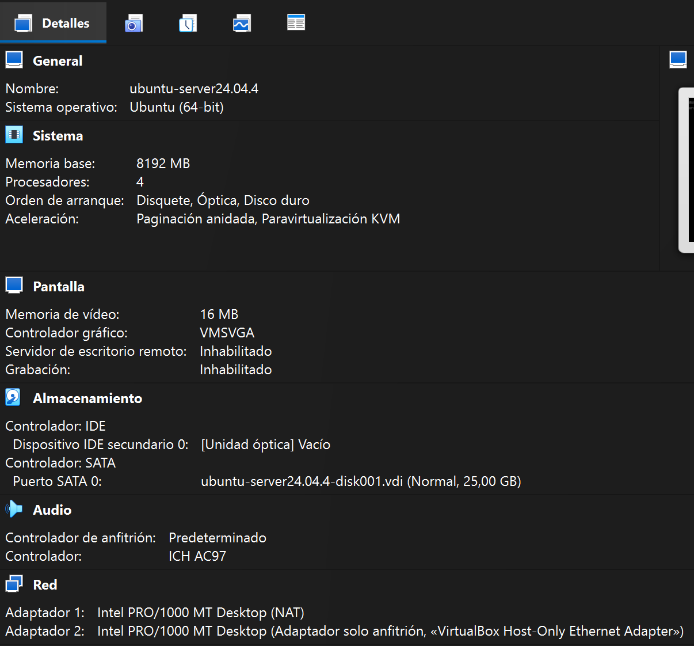

## Instal·lació

Instal·lem ssh i nginx:

```bash
sudo apt install ssh -y
sudo apt install nginx -y
```

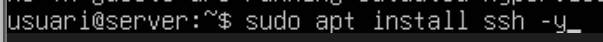


Habilitem el firewall

```bash
sudo ufw enable
```

Després, comprovem l'estat

```bash
ufw status verbose
```

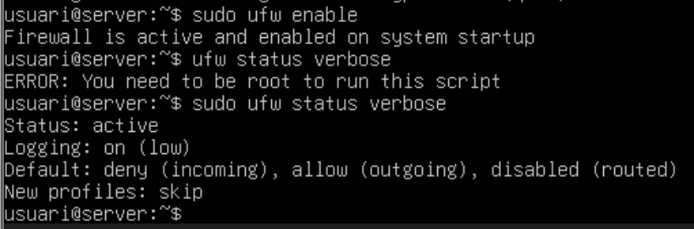

## Configuracions del Firewall

Definim el comportament del firewall per les connexions de negació (deny)

```bash
sudo ufw default deny
```

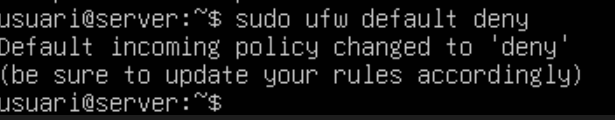

Configurem les connexions a aplicacions.

```bash
ufw app list
```

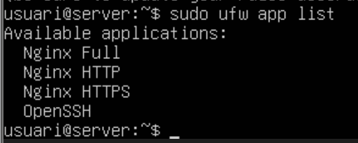

Després, donem permís a les aplicacions que vulguem.

```bash
sudo ufw allow ssh
sudo ufw allow "Nginx HTTPS"
```

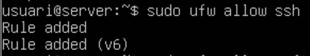
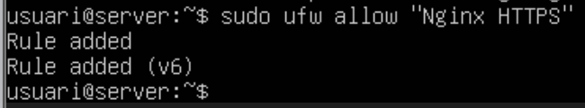

Per permetre o denegar connexions a adreces determinades, introduïm la seguent comanda (exemple d'ip inventada):

**Per permetre la connexió:**
```bash
sudo ufw allow fromm 192.168.1.3
```

**Per denegar la connexió:**

```bash
sudo ufw deny from 192.168.1.2
``` 

**Per denegar totes les ips d'una xarxa:**

```bash
sudo ufw deny from 10.12.10.0/24
``` 

**Per denegar connexions d'adreces determinades:**

```bash
sudo ufw deny out to 192.168.14.23
```

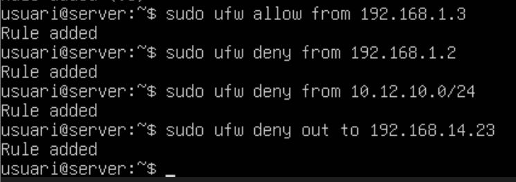

Per combinar regles IP i port introduïm les seguents comandes:

**Per permetre connexió:**

```bash
sudo ufw allow 192.168.1.4 to any port 44
```

**Per denegar connexió:**

```bash
sudo ufw deny 136.132.0.0/16 to any port 22
```

**Per permetre connexió tcp però no udp:**

```bash
sudo ufw allow from 192.168.0.4 to any port 22 proto tcp
```

Podem veure les regles definides:

```bash
sudo ufw status numbered
```

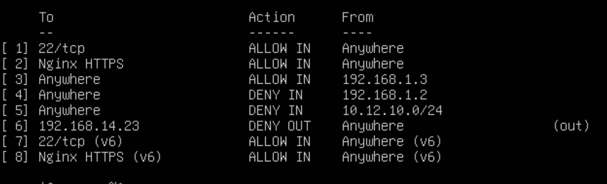

Per eliminar una regla del firewall hem d'identificar el seu número:

```bash
sudo ufw status numbered
```

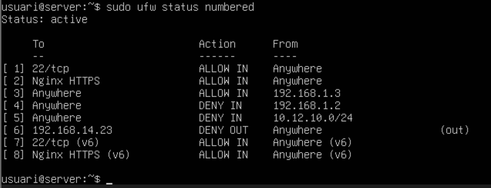

I després, introduïm la comanda amb el número per eliminar la regla.

```bash
sudo ufw delete [Numero]
```

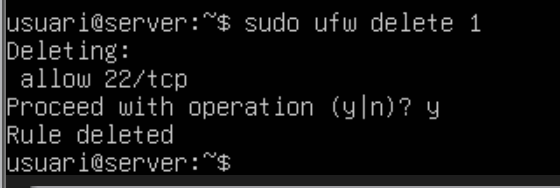

## Activitats UFW

## 1. Comprova l’estat del firewall i si cal habilita’l

Primer comprovem l’estat del firewall:

```bash
sudo ufw status verbose
```

Si el firewall està inactiu (`inactive`), l’habilitem amb:

```bash
sudo ufw enable
```

Tornem a comprovar l’estat:

```bash
sudo ufw status verbose
```

Sortida esperada:

```bash
Status: active
```

---

## 2. Mostra les regles que té definides. Quines són les regles per defecte?

Mostrem totes les regles definides:

```bash
sudo ufw status numbered
```

Les regles per defecte solen ser:

```bash
Default: deny (incoming), allow (outgoing), disabled (routed)
```

Això significa:

- Es deneguen connexions entrants
- Es permeten connexions sortints
- El trànsit reenviat està deshabilitat

### Eliminar regles definides

Si hi ha regles creades, les eliminem deixant només el comportament per defecte.

Primer consultem els números:

```bash
sudo ufw status numbered
```

Exemple:

```bash
[1] 22/tcp ALLOW IN Anywhere
[2] Nginx HTTPS ALLOW IN Anywhere
```

Eliminem les regles:

```bash
sudo ufw delete 1
sudo ufw delete 2
```

Comprovem de nou:

```bash
sudo ufw status numbered
```

---

## 3. Comprova la regla per defecte de deny pel trànsit d’entrada

Configurem la política per defecte d’entrada:

```bash
sudo ufw default deny incoming
```

Comprovem-ho:

```bash
sudo ufw status verbose
```

Resultat esperat:

```bash
Default: deny (incoming)
```

Ara intentem connectar-nos via SSH des de l’amfitrió:

```bash
ssh usuari@IP_MAQUINA
```

La connexió fallarà perquè el port 22 no està permès.

Exemple d’error:

```bash
Connection refused
```

---

## 4. Aplica regla per defecte deny al trànsit de sortida

Configurem el trànsit de sortida:

```bash
sudo ufw default deny outgoing
```

Comprovem l’estat:

```bash
sudo ufw status verbose
```

Ara provem de fer ping a Google:

```bash
ping google.com
```

El ping no funcionarà perquè el trànsit de sortida està bloquejat.

---

# Activitats-II

## 5. Aplica regla per defecte allow al trànsit de sortida

Permetem el trànsit de sortida:

```bash
sudo ufw default allow outgoing
```

Comprovem-ho:

```bash
sudo ufw status verbose
```

Provem de nou el ping:

```bash
ping google.com
```

Ara el ping hauria de respondre correctament.

Exemple:

```bash
64 bytes from ...
```

---

## 6. Crear una regla per prohibir el trànsit cap a capgros.elnacional.cat

Creem la regla:

```bash
sudo ufw deny out to capgros.elnacional.cat
```

Si no funciona per DNS, primer obtenim la IP:

```bash
ping capgros.elnacional.cat
```

Exemple:

```bash
capgros.elnacional.cat (34.xxx.xxx.xxx)
```

I bloquegem la IP:

```bash
sudo ufw deny out to 34.xxx.xxx.xxx
```

Comprovem la connexió:

```bash
ping capgros.elnacional.cat
```

o bé accedint des del navegador.

La connexió hauria de quedar bloquejada.

---

## 7. Habilita el trànsit d’entrada pel servei nginx per la IP de l’amfitrió (192.168.56.1)

Permetem només l’accés HTTP des de l’amfitrió:

```bash
sudo ufw allow from 192.168.56.1 to any port 80 proto tcp
```

Comprovem les regles:

```bash
sudo ufw status numbered
```

Des de l’amfitrió obrim el navegador:

```text
http://IP_DE_LA_MAQUINA
```

Hauria d’aparèixer la pàgina per defecte de Nginx.

---

## 8. Mostra el conjunt de regles definides

Finalment mostrem totes les regles configurades:

```bash
sudo ufw status numbered
```

Exemple de resultat:

```bash
Status: active

[1] 80/tcp ALLOW IN 192.168.56.1
[2] Anywhere DENY OUT capgros.elnacional.cat
```

També podem veure informació detallada:

```bash
sudo ufw status verbose
```

